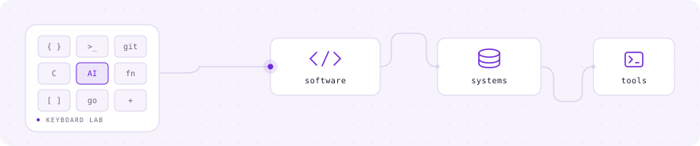
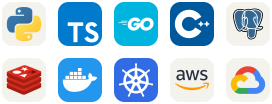
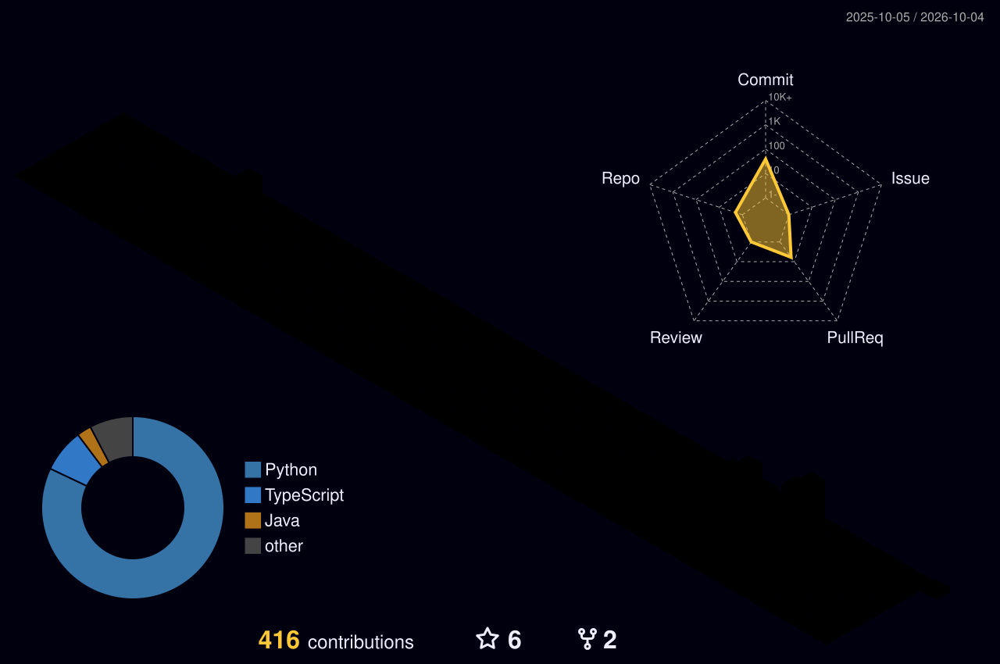

# Hi, I'm Hung Ngo 👋

<picture>
  <source media="(prefers-reduced-motion: reduce) and (prefers-color-scheme: dark)" srcset="./assets/keyboard-lab-dark.svg">
  <source media="(prefers-reduced-motion: reduce)" srcset="./assets/keyboard-lab-light.svg">
  <source media="(prefers-color-scheme: dark)" srcset="./assets/keyboard-lab-dark-animated.svg">
  <source media="(prefers-color-scheme: light)" srcset="./assets/keyboard-lab-light-animated.svg">
  
</picture>

I like following a problem through every layer until I understand why it behaves the way it does. That has taken me from payment events and database migrations to real time AI agents, keyboard firmware, and the tools I use to build all of them.

I'm studying Computer Science, Statistics and Data Science at UMass Amherst, graduating in December 2026. My recent internships have been at **Rippling, Google, and PlayStation**.

[Website](https://hungngo.me/) · [LinkedIn](https://www.linkedin.com/in/hungngo1607/) · [Email](mailto:hungngo1607@gmail.com)

## What I've been working on

- **Rippling · Corporate Card:** International payment rails and settlement processing. I worked on idempotent Kafka consumers, transaction lifecycles, query optimization, request hedging, and concurrency control so payments stayed correct when events arrived late, twice, or out of order.
- **Google · Cloud Platform Applied AI:** Real time conversational agents with WebRTC media transport, dynamic frame clustering, and gaze signals. I worked across the media and model pipelines to make an agent respond faster and understand changes in user intent.
- **PlayStation · Payments and Subscriptions:** A data transformation layer for storefront rollouts, PostgreSQL migrations, and deployments without downtime. I enjoyed turning manual, hardcoded processes into systems teams could safely extend.

The part I care about most is staying with the work through deployment: understanding the failure modes, testing the assumptions, and making the result useful to the people relying on it.

## A few things I've built

| Project | What I wanted to make possible |
| --- | --- |
| **[CodeBuddy](https://github.com/nickbar01234/codebuddy)** · [Chrome Web Store](https://chromewebstore.google.com/detail/codebuddy/pdejahgboaggjdcfgmnccgfjaolikplf) | Practice LeetCode with friends while seeing each other's code live. WebRTC carries code updates between peers; Firestore handles signaling. The interesting work included accessing Monaco inside the page, separating extension execution contexts, and recovering peer connections. |
| **[Flavorie](https://github.com/hungngodev/Flavorie)** | Turn groceries into meals and make cooking more social. I led a team of four on the app and Chrome extension, with receipt parsing workers, Redis, and live collaboration behind the experience. |
| **[NEFAC chatbot](https://github.com/hungngodev/NEFAC-CHATBOT)** | Help people find relevant legal and public information. I led six developers on an AI retrieval system, connecting document ingestion, search, and streamed answers to a usable interface. |

## The setup I keep tinkering with

I build my working environment with the same care I put into a product. Shared configuration lets me switch agents while keeping the same instructions and tools. Obsidian holds what I learn; Notion keeps the next action visible. Tailscale connects my Mac, phone, iPad, and DGX Spark as I work toward being able to start or check on work wherever I am.

How the pieces fit together

- **Shared configuration:** `botfile` and `sync-mcp` keep skills, prompts, instructions, and MCP connections centrally managed across Codex, Claude Code, Gemini/Antigravity, and Pi.
- **Agent collaboration:** I'm experimenting with ACPX for named sessions scoped to a project, reusable handoffs, and follow-ups with readable history and status. Authentication and compatibility are still works in progress.
- **Code context:** Code graphs and repository maps help me trace symbols and call relationships. Direct file search handles configuration and logs; Context7 supplies library documentation. I choose the route based on the question.
- **Knowledge and action:** Concepts, lessons, and decisions live in Obsidian; tasks, deadlines, and appointments live in Notion. Both link back to original sources, and related ideas build on one another instead of being copied everywhere.
- **Memory:** I'm exploring separate layers for code relationships, project knowledge with Cognee, and personal preferences with Mem0. The goal is relevant recall with clear sources and fewer contradictory copies.

I test whether a tool actually earns its place in that workflow. The part I enjoy is making the tools fit together well enough that I can spend more time on the problem.

## Keyboards, firmware, and things I can hold

I love building mechanical keyboards. That curiosity pulled me into low level C, ZMK, key matrices, layers, macros, and debounce behavior. My [public keyboard configurations](https://github.com/hungngodev/Keyboard-json-file) include KMK firmware and VIA/QMK layouts. I also design and 3D print parts and experiment with artisan keycaps in Autodesk Fusion.

Lately, I've been designing an adaptive macropad with nine keys, individual OLED displays, and Hall sensors. I want its shortcuts and labels to follow the application I'm using and help me learn useful actions. It's still a design project, and I'm enjoying the questions it raises across hardware, firmware, and software.

Purple is still my favorite color. Some things survive every refactor.

## Languages and tools

<picture>
  <source media="(prefers-color-scheme: dark)" srcset="./assets/skills-dark.svg">
  
</picture>

**Languages:** Python, TypeScript/JavaScript, Go, C++, Java, and C for firmware experiments.  
**Systems and applications:** Kafka, Redis, PostgreSQL, WebRTC, Django, React, Next.js, Docker, Kubernetes, AWS, and Google Cloud.

Contribution graph

