<h1 align="center">Hung Ngo</h1>

Software engineer · UMass Amherst 
I build reliable systems and useful AI.

  
  
  
  
  

## Activity

  <picture>
    <source media="(prefers-color-scheme: dark)" srcset="./assets/stats/stats-dark.svg">
    
  </picture>
  <picture>
    <source media="(prefers-color-scheme: dark)" srcset="./assets/stats/languages-dark.svg">
    
  </picture>

## Experience

<picture>
  <source media="(max-width: 600px) and (prefers-color-scheme: dark)" srcset="./assets/dashboard/experience-dark-mobile.svg">
  <source media="(max-width: 600px)" srcset="./assets/dashboard/experience-light-mobile.svg">
  <source media="(prefers-color-scheme: dark)" srcset="./assets/dashboard/experience-dark.svg">
  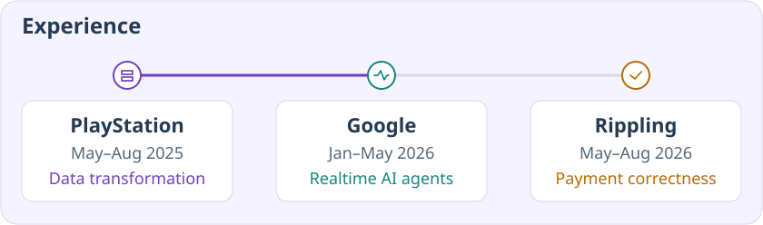
</picture>

## Builds

  <a href="https://github.com/nickbar01234/codebuddy"><picture>
    <source media="(prefers-color-scheme: dark)" srcset="./assets/dashboard/project-codebuddy-dark.svg">
    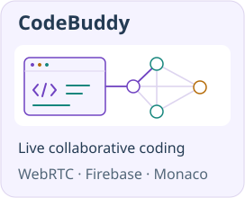
  </picture></a>
  <a href="https://github.com/hungngodev/Flavorie"><picture>
    <source media="(prefers-color-scheme: dark)" srcset="./assets/dashboard/project-flavorie-dark.svg">
    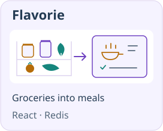
  </picture></a>
  <a href="https://github.com/hungngodev/NEFAC-CHATBOT"><picture>
    <source media="(prefers-color-scheme: dark)" srcset="./assets/dashboard/project-nefac-dark.svg">
    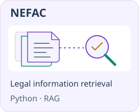
  </picture></a>

  <a href="https://chromewebstore.google.com/detail/codebuddy/pdejahgboaggjdcfgmnccgfjaolikplf">CodeBuddy ↗ Store</a> ·
  <a href="https://flavorie.xyz/">Flavorie ↗ Live</a> 
  More builds: <a href="https://hungngodev.github.io/ChromaMix/">ChromaMix</a> ·
  <a href="https://internshipforum-80226f6855ff.herokuapp.com/internships">Internship Forum</a> ·
  <a href="https://internshipforumv1-1bc3d87eae50.herokuapp.com/internships/new">Forum V1</a> (legacy, currently unavailable)

## Setup

<picture>
  <source media="(max-width: 600px) and (prefers-reduced-motion: reduce) and (prefers-color-scheme: dark)" srcset="./assets/dashboard/setup-dark-mobile-static.svg">
  <source media="(max-width: 600px) and (prefers-reduced-motion: reduce)" srcset="./assets/dashboard/setup-light-mobile-static.svg">
  <source media="(max-width: 600px) and (prefers-color-scheme: dark)" srcset="./assets/dashboard/setup-dark-mobile.svg">
  <source media="(max-width: 600px)" srcset="./assets/dashboard/setup-light-mobile.svg">
  <source media="(prefers-reduced-motion: reduce) and (prefers-color-scheme: dark)" srcset="./assets/dashboard/setup-dark-static.svg">
  <source media="(prefers-reduced-motion: reduce)" srcset="./assets/dashboard/setup-light-static.svg">
  <source media="(prefers-color-scheme: dark)" srcset="./assets/dashboard/setup-dark.svg">
  
</picture>

## Keyboard & toolbox

<a href="https://github.com/hungngodev/Keyboard-json-file"><picture>
  <source media="(prefers-color-scheme: dark)" srcset="./assets/dashboard/keyboard-dark.svg">
  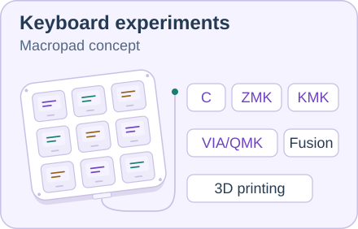
</picture></a>

<!-- TOOLBOX:START -->

  <a href="https://www.python.org" title="Python"><picture><source media="(prefers-color-scheme: dark)" srcset="./assets/icons/Python-Dark.svg">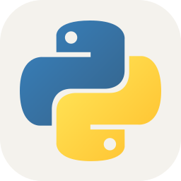</picture></a>
  <a href="https://www.typescriptlang.org/" title="TypeScript"><picture><source media="(prefers-color-scheme: dark)" srcset="./assets/icons/TypeScript.svg">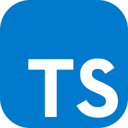</picture></a>
  <a href="https://developer.mozilla.org/en-US/docs/Web/JavaScript" title="JavaScript"><picture><source media="(prefers-color-scheme: dark)" srcset="./assets/icons/JavaScript.svg"></picture></a>
  <a href="https://go.dev/" title="Go"><picture><source media="(prefers-color-scheme: dark)" srcset="./assets/icons/GoLang.svg"></picture></a>
  <a href="https://isocpp.org/" title="C++"><picture><source media="(prefers-color-scheme: dark)" srcset="./assets/icons/CPP.svg">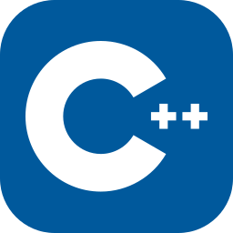</picture></a>
  <a href="https://www.cprogramming.com/" title="C"><picture><source media="(prefers-color-scheme: dark)" srcset="./assets/icons/C.svg"></picture></a>
  <a href="https://www.java.com" title="Java"><picture><source media="(prefers-color-scheme: dark)" srcset="./assets/icons/Java-Dark.svg"></picture></a>
  <a href="https://www.w3.org/html/" title="HTML"><picture><source media="(prefers-color-scheme: dark)" srcset="./assets/icons/HTML.svg"></picture></a>
  <a href="https://www.w3schools.com/css/" title="CSS"><picture><source media="(prefers-color-scheme: dark)" srcset="./assets/icons/CSS.svg">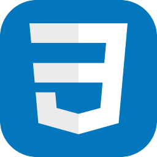</picture></a>
  <a href="https://sass-lang.com" title="Sass"><picture><source media="(prefers-color-scheme: dark)" srcset="./assets/icons/Sass.svg"></picture></a>
  <a href="https://reactjs.org/" title="React"><picture><source media="(prefers-color-scheme: dark)" srcset="./assets/icons/React-Dark.svg"></picture></a>
  <a href="https://nextjs.org/" title="Next.js"><picture><source media="(prefers-color-scheme: dark)" srcset="./assets/icons/NextJS-Dark.svg">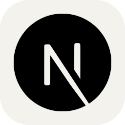</picture></a>
  <a href="https://redux.js.org" title="Redux"><picture><source media="(prefers-color-scheme: dark)" srcset="./assets/icons/Redux.svg">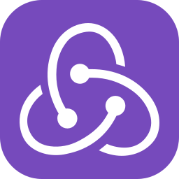</picture></a>
  <a href="https://tailwindcss.com/" title="Tailwind"><picture><source media="(prefers-color-scheme: dark)" srcset="./assets/icons/TailwindCSS-Dark.svg">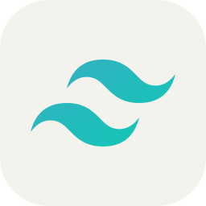</picture></a>
  <a href="https://getbootstrap.com" title="Bootstrap"><picture><source media="(prefers-color-scheme: dark)" srcset="./assets/icons/Bootstrap.svg">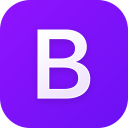</picture></a>
  <a href="https://nodejs.org" title="Node.js"><picture><source media="(prefers-color-scheme: dark)" srcset="./assets/icons/NodeJS-Dark.svg">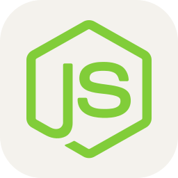</picture></a>
  <a href="https://expressjs.com" title="Express"><picture><source media="(prefers-color-scheme: dark)" srcset="./assets/icons/ExpressJS-Dark.svg"></picture></a>
  <a href="https://www.djangoproject.com/" title="Django"><picture><source media="(prefers-color-scheme: dark)" srcset="./assets/icons/Django.svg"></picture></a>
  <a href="https://flask.palletsprojects.com/" title="Flask"><picture><source media="(prefers-color-scheme: dark)" srcset="./assets/icons/Flask-Dark.svg"></picture></a>
  <a href="https://www.chartjs.org" title="Chart.js"><picture><source media="(prefers-color-scheme: dark)" srcset="./assets/icons/chartjs.svg"></picture></a>
  <a href="https://github.com/puppeteer/puppeteer" title="Puppeteer"><picture><source media="(prefers-color-scheme: dark)" srcset="./assets/icons/puppeteer.svg"></picture></a>
  <a href="https://www.postgresql.org/" title="PostgreSQL"><picture><source media="(prefers-color-scheme: dark)" srcset="./assets/icons/PostgreSQL-Dark.svg"></picture></a>
  <a href="https://www.mysql.com/" title="MySQL"><picture><source media="(prefers-color-scheme: dark)" srcset="./assets/icons/MySQL-Dark.svg">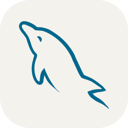</picture></a>
  <a href="https://www.mongodb.com/" title="MongoDB"><picture><source media="(prefers-color-scheme: dark)" srcset="./assets/icons/MongoDB.svg"></picture></a>
  <a href="https://www.sqlite.org/" title="SQLite"><picture><source media="(prefers-color-scheme: dark)" srcset="./assets/icons/SQLite.svg"></picture></a>
  <a href="https://redis.io" title="Redis"><picture><source media="(prefers-color-scheme: dark)" srcset="./assets/icons/Redis-Dark.svg">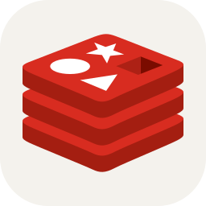</picture></a>
  <a href="https://kafka.apache.org/" title="Kafka"><picture><source media="(prefers-color-scheme: dark)" srcset="./assets/icons/Kafka.svg">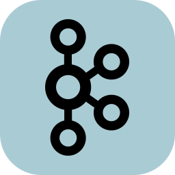</picture></a>
  <a href="https://firebase.google.com/" title="Firebase"><picture><source media="(prefers-color-scheme: dark)" srcset="./assets/icons/Firebase-Dark.svg"></picture></a>
  <a href="https://www.docker.com/" title="Docker"><picture><source media="(prefers-color-scheme: dark)" srcset="./assets/icons/Docker.svg"></picture></a>
  <a href="https://kubernetes.io/" title="Kubernetes"><picture><source media="(prefers-color-scheme: dark)" srcset="./assets/icons/Kubernetes.svg"></picture></a>
  <a href="https://aws.amazon.com" title="AWS"><picture><source media="(prefers-color-scheme: dark)" srcset="./assets/icons/AWS-Dark.svg"></picture></a>
  <a href="https://cloud.google.com" title="Google Cloud"><picture><source media="(prefers-color-scheme: dark)" srcset="./assets/icons/GCP-Dark.svg"></picture></a>
  <a href="https://heroku.com" title="Heroku"><picture><source media="(prefers-color-scheme: dark)" srcset="./assets/icons/Heroku.svg"></picture></a>
  <a href="https://www.nginx.com" title="Nginx"><picture><source media="(prefers-color-scheme: dark)" srcset="./assets/icons/Nginx.svg">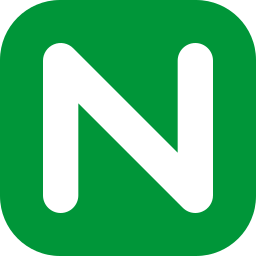</picture></a>
  <a href="https://www.linux.org/" title="Linux"><picture><source media="(prefers-color-scheme: dark)" srcset="./assets/icons/Linux-Dark.svg"></picture></a>
  <a href="https://git-scm.com/" title="Git"><picture><source media="(prefers-color-scheme: dark)" srcset="./assets/icons/Git.svg">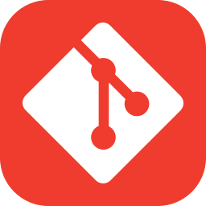</picture></a>
  <a href="https://pytorch.org/" title="PyTorch"><picture><source media="(prefers-color-scheme: dark)" srcset="./assets/icons/PyTorch-Dark.svg">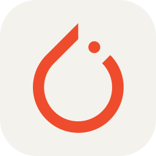</picture></a>
  <a href="https://opencv.org/" title="OpenCV"><picture><source media="(prefers-color-scheme: dark)" srcset="./assets/icons/OpenCV-Dark.svg">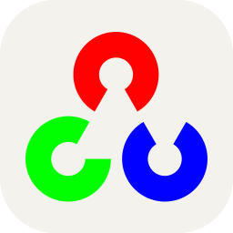</picture></a>
  <a href="https://www.arduino.cc/" title="Arduino"><picture><source media="(prefers-color-scheme: dark)" srcset="./assets/icons/Arduino.svg">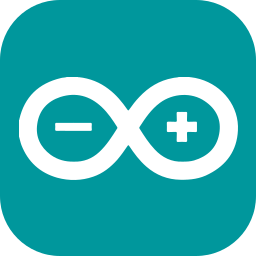</picture></a>

<!-- TOOLBOX:END -->

<a href="./assets/SOURCES.md">Visual credits</a>
