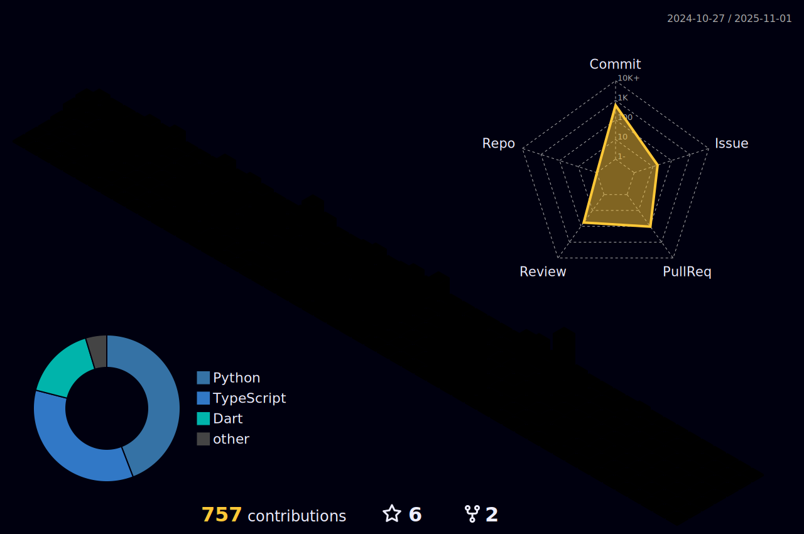

<h1 align="center">Hi 👋, I'm Hung Ngo</h1>
<h3 align="center">A passionate CS students</h3>
- 👨‍💻 More information about me https://hungngo.vercel.app/

- 🔭 My proudest project: a forum for everyone to share their thoughts about their internships [Internship Forum](https://internshipforum-80226f6855ff.herokuapp.com/internships) 🌐 The legacy version: [Internship ForumV1](https://internshipforumv1-1bc3d87eae50.herokuapp.com/internships/new)

- 🎨 Another handy website to choose your dream color!! [ChromaMix](https://hungngodev.github.io/ChromaMix/)

- 📫 How to reach me **hungngo1607@gmail.com**

- ⚡ Fun fact **I love building mechanical keyboards and I love colorful colors like purplee!!!!!**

<h3 align="left">Connect with me:</h3>

<h3 align="left">Languages and Tools:</h3>

                        

